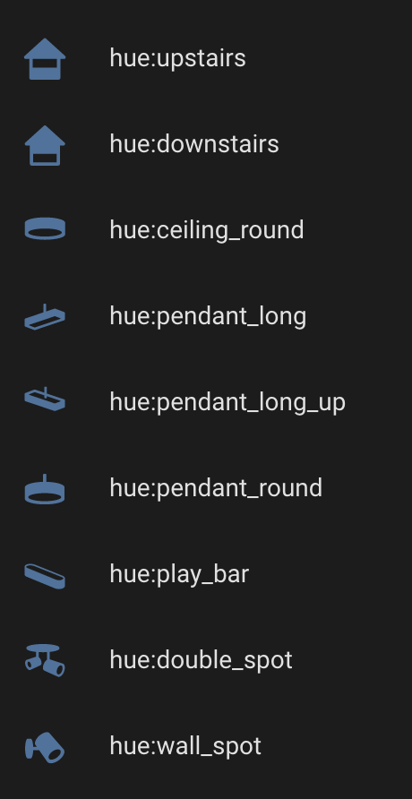

# hass-hue-icons

Vector based icon pack for Home Assistant, inspired by the Hue icons. For personal use only.

## Installation

- Copy `hass-hue-icons.js` into your config/www folder.
- Go to Configuration -> Lovelace Dashboards -> Resources -> Add Resource
- set url as `/local/hass-hue-icons.js` and Resource Type as `Javascript Module`.
- Save, restart Home Assistant.

## Usage

- In your entity editor, specify an icon as `hue:icon_name` 
- If you set `state_color: true` in your card, you'll see the icons get colorised based upon the current RGB setting.

### Example:

```
title: My Room
state_color: true
type: entities
entities:
  - entity: light.my_wall_light
    name: My Wall Light
    icon: hue:wall_spot
```

### Icon set



### Sample Dash (with view icons and state color applied)


### Troubleshooting:
If you cannot see the new icons, or you get an empty box where you're expecting an icon, flush your network cache. 

# Thanks and Props
@hulkhaugen and @thomasloven for the technique.
